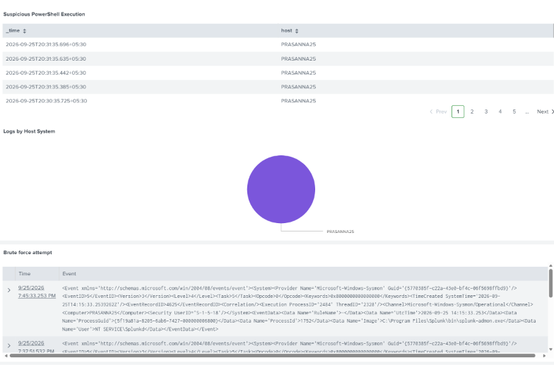

# 🛡️ SOC Threat Detection & Security Monitoring using Splunk & Sysmon

<p align="center">
  
</p>

<p align="center">
  <b>Windows 11 | Microsoft Sysmon | Splunk Enterprise | SPL | MITRE ATT&CK</b>
</p>

---

## 📸 Project Screenshots

### 🖥️ SOC Threat Detection Dashboard

<p align="center">
  
</p>

---

### 📊 Dashboard Overview

<p align="center">
  
</p>

---

### ⚡ Encoded PowerShell Command Execution

<p align="center">
  
</p>

---

### 🔎 SPL Detection for Encoded PowerShell

<p align="center">
  
</p>

---

### 🔐 Brute Force / Failed Login Detection

<p align="center">
  
</p>

---

### 📝 Splunk Recent Log Events

<p align="center">
  
</p>

---

### 📈 Total Events

<p align="center">
  
</p>

---

# 📌 Project Overview

This project demonstrates an end-to-end **Security Operations Center (SOC) threat detection and security monitoring workflow** on a Windows 11 endpoint using **Splunk Enterprise** and **Microsoft Sysmon**.

The project simulates suspicious endpoint activities, captures security telemetry using Sysmon, ingests Windows and Sysmon logs into Splunk, analyzes the events using **SPL (Search Processing Language)**, and visualizes important security events through a SOC monitoring dashboard.

The project focuses on detecting and investigating:

- 🔐 Failed authentication / brute-force activity
- ⚡ Encoded PowerShell command execution
- 🖥️ Windows endpoint activity
- 🔎 Suspicious security events
- 📊 Security telemetry through Splunk dashboards

---

# 🎯 Project Objectives

The main objectives of this project are:

- Understand how a SIEM is used in a SOC environment.
- Configure endpoint monitoring using Microsoft Sysmon.
- Ingest Windows and Sysmon logs into Splunk.
- Write SPL queries for security monitoring and threat hunting.
- Detect suspicious PowerShell activity.
- Monitor failed authentication attempts.
- Investigate Windows Security Event ID `4625`.
- Analyze Sysmon Process Creation Event ID `1`.
- Build a SOC monitoring dashboard.
- Understand a practical SOC detection workflow.

---

# 🏗️ Project Architecture

```text
                    ┌──────────────────────┐
                    │      Windows 11      │
                    │      Endpoint        │
                    └──────────┬───────────┘
                               │
                               ▼
                    ┌──────────────────────┐
                    │    Microsoft Sysmon  │
                    │   Endpoint Telemetry │
                    └──────────┬───────────┘
                               │
                               ▼
                    ┌──────────────────────┐
                    │   Windows / Sysmon   │
                    │        Logs          │
                    └──────────┬───────────┘
                               │
                               ▼
                    ┌──────────────────────┐
                    │      inputs.conf     │
                    │    Log Ingestion     │
                    └──────────┬───────────┘
                               │
                               ▼
                    ┌──────────────────────┐
                    │  Splunk Enterprise   │
                    │        SIEM          │
                    └──────────┬───────────┘
                               │
                               ▼
                    ┌──────────────────────┐
                    │      SPL Queries     │
                    │   Threat Hunting     │
                    └──────────┬───────────┘
                               │
                 ┌─────────────┴─────────────┐
                 │                           │
                 ▼                           ▼
        ┌──────────────────┐       ┌──────────────────┐
        │ Encoded PowerShell│       │ Failed Logons    │
        │    Detection      │       │   Event ID 4625  │
        └─────────┬────────┘       └─────────┬────────┘
                  │                          │
                  └────────────┬─────────────┘
                               ▼
                    ┌──────────────────────┐
                    │ Investigation &      │
                    │ Security Analysis    │
                    └──────────┬───────────┘
                               │
                               ▼
                    ┌──────────────────────┐
                    │   SOC Dashboard      │
                    │ Visualization &       │
                    │ Monitoring            │
                    └──────────────────────┘
